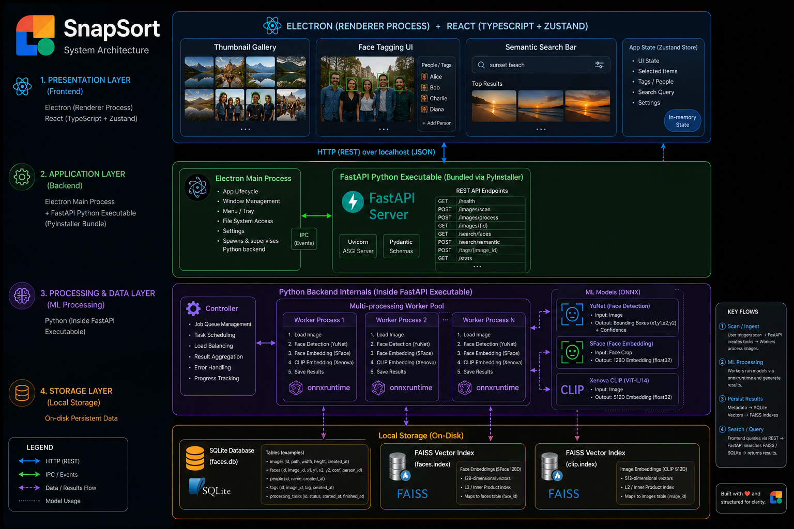

# SnapSort

SnapSort is an open-source, cross-platform desktop application for offline, AI-powered image sorting, semantic searching, and face tagging. Select a folder of photos and instantly browse thumbnails; in the background, SnapSort will detect faces, extract semantic text-to-image embeddings, build a searchable embedding index, and let you:

- Search for photos by typing descriptions (e.g., "tree in sunset", "group of people outdoors").
- Search for photos by typing a specific person's name (e.g., "Rahul hiking").
- Click any photo to see the faces it contains, and tag them with names.
- Click a face thumbnail to filter the gallery down to every image where that person appears.
- Merge multiple occurrences of the same person.

Everything runs locally—no cloud uploads. SnapSort uses an Electron + React (TypeScript) frontend and a Python backend (FastAPI) utilizing `onnxruntime` with OpenCV (YuNet + SFace + CLIP) for machine learning, SQLite for metadata, and Faiss for fast vector search.

Website: [https://snapsort-website.vercel.app/](https://snapsort-website.vercel.app/)

> 📌 **Want to see what's coming next?** Check out the [todo.md](todo.md) for upcoming features, fixes, and improvements.

## Architecture



## Features

- **Instant Thumbnail Gallery**: Loads and displays all images in a selected folder immediately, with a masonry layout.
- **Background AI Processing**: Uses multiprocessing to detect faces (YuNet), extract face embeddings (SFace), and compute semantic image embeddings (CLIP) without blocking the UI.
- **Semantic Search & Name Recognition**: Type what you're looking for, or type a tagged person's name to instantly find matching photos using advanced cosine-similarity FAISS search and fuzzy text matching.

## Performance & Benchmarks

SnapSort runs an incredibly heavy and accurate machine learning pipeline **100% offline on your local CPU** using `onnxruntime` and a multi-worker processing architecture. The pipeline performs the following for *every single image*:
1. Face Detection (`YuNet`)
2. Facial Feature Extraction (`SFace` - 128D embedding per face)
3. Semantic Image Embedding (`Xenova CLIP` - 512D text-to-image feature)

**Benchmark Results (4-Core CPU Processing)**:
- **Throughput**: ~2.5 to 3 images per second
- **Time per image**: ~0.38 seconds 
- **1,000 Photo Gallery**: Completely indexed in roughly 6.5 minutes

*Note: Future updates aim to support GPU execution providers (CUDA/CoreML) which could theoretically increase processing speeds by 10x or more.*

> Want to benchmark your own hardware? You can run the included benchmark script:
> `python scripts/benchmark.py /path/to/your/photos`
- **Persistent Index & Metadata**: Stores high-dimensional vector embeddings in Faiss (`data/faces.index`, `data/clip.index`) and records image/face occurrences in a local SQLite database (`data/faces.db`).
- **CPU-Optimized & Lightweight**: Uses highly optimized ONNX models that run incredibly fast on standard consumer CPUs.
- **Privacy First**: 100% offline, local processing.


## Installation

Download the latest installer for your platform from the [GitHub Releases](https://github.com/ASK-03/SnapSort/releases) page.

### macOS
Download the `.dmg` installer directly from the Releases page. If Gatekeeper blocks the app, you can bypass it by running the following command in your terminal after installation:

```bash
xattr -rd com.apple.quarantine /Applications/SnapSort.app
```
*Note: Give your terminal Full Disk Access in System Settings > Privacy & Security to grant you access and then run the above command.*

### Windows
Download the `.exe` installer directly from the Releases page.

### Linux
Three packages are published to the Releases page for each version. Pick the one that matches your distro:

**Debian / Ubuntu / Pop!_OS (.deb)**
```bash
sudo apt install ./SnapSort-Linux-latest.deb
```

**Arch / Manjaro (.pacman)**
```bash
sudo pacman -U SnapSort-Linux-latest.pacman
```

**Any distro (.AppImage)**
```bash
chmod +x SnapSort-Linux-*.AppImage
./SnapSort-Linux-*.AppImage
```

## Development Setup

SnapSort is divided into an Electron frontend (`desktop/`) and a Python backend (`backend/`).

### Requirements
- Node.js (v18+)
- Python ≥ 3.10

### 1. Backend Setup
Create a virtual environment and install dependencies:
```bash
python3 -m venv env
source env/bin/activate
pip install -r requirements.txt
```
Download the required AI models:
```bash
python scripts/download_models.py
```

### 2. Frontend Setup
Install Node dependencies:
```bash
cd desktop
npm install
```

### 3. Run Development Server
```bash
cd desktop
npm run dev
```
*The Vite development server will start, launch the Electron app, and automatically spawn the Python backend subprocess.*

## Contributing

Contributions are welcome! To help:
1. Fork the repository.
2. Create a feature branch: `git checkout -b my-cool-feature`
3. Commit your changes: `git commit -am "Add new feature"`
4. Push to the branch: `git push origin my-cool-feature`
5. Open a Pull Request.

Please see [AGENTS.md](AGENTS.md) for architectural guidelines and AI-assisted development instructions.

## License

This project is licensed under the MIT License. See the `LICENSE` file for details.
